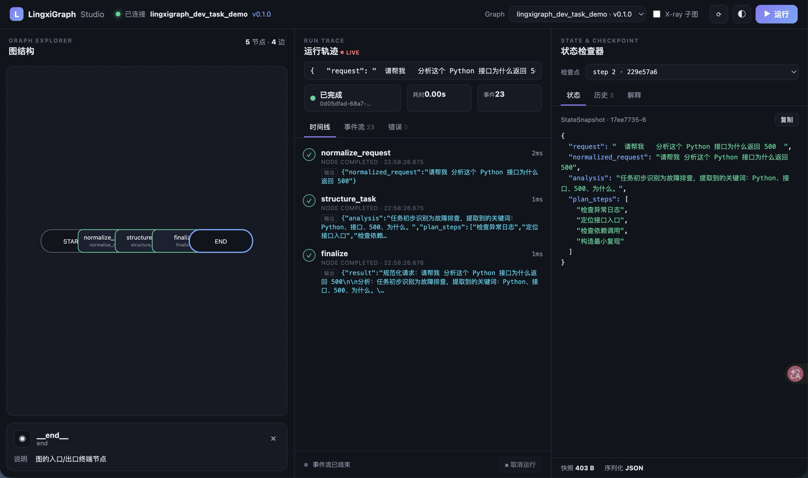

# lingxigraph-dev-task-demo

一个不依赖大模型的 LingxiGraph 最小技术验证项目，用于逐步演示状态图、条件路由、流式事件、人工审批、自动重试和 Checkpoint 恢复。

## 环境要求

- macOS
- Python 3.13.12
- uv
- LingxiGraph 2.x

## 安装

```bash
uv sync
```

## 启动本地开发服务器

```
uv run lingxigraph dev
```

## Studio 地址：

```
http://127.0.0.1:8124/studio/
```

## 验证 Python 版本

```
uv run python --version
```

## Develop

```bash
lingxigraph dev
```

Runs an in-memory Agent Server with an embedded Worker and opens the Studio at
http://localhost:8124/studio — no PostgreSQL or Redis required.

## Deploy (Docker Compose, single server)

```bash
lingxigraph up
```

Brings up PostgreSQL, Redis, migrations and the Agent Server (with embedded
Worker) on http://localhost:8124. Studio is served at `/studio`.

## Build the image

```bash
lingxigraph build
```

## Layout

- `lingxigraph_dev_task_demo/graph.py` — your trusted agent graph.
- `lingxigraph.json` — the manifest the Worker imports at deploy time.
- `docker-compose.yml` — single-server production topology.

## Stage 1：文本处理流水线

Stage 1 使用三个确定性的 Python 节点处理开发任务，不依赖任何大模型：

```text
START
  ↓
normalize_request
  ↓
structure_task
  ↓
finalize
  ↓
END
```

节点职责：

- `normalize_request`：保留原始请求，去除首尾空格并合并多余空白。
- `structure_task`：按照确定性关键词规则生成任务分析和处理步骤。
- `finalize`：将规范化请求、分析和步骤汇总为统一结果。

### 本地调用

```bash
uv run python - <<'PY'
from lingxigraph_dev_task_demo.graph import graph

result = graph.invoke({
    "request": "  请帮我   分析这个 Python 接口为什么返回 500  "
})

print(result["result"])
PY
```

### 流式输出

Stage 1 同时支持：

- `updates`：观察各节点提交的状态增量。
- `custom`：观察节点通过 `runtime.stream_writer()` 发送的业务进度。

```python
for mode, chunk in graph.stream(
    {"request": "请分析接口返回 500 的原因"},
    stream_mode=["updates", "custom"],
):
    print(mode, chunk)
```

### Studio 截图


