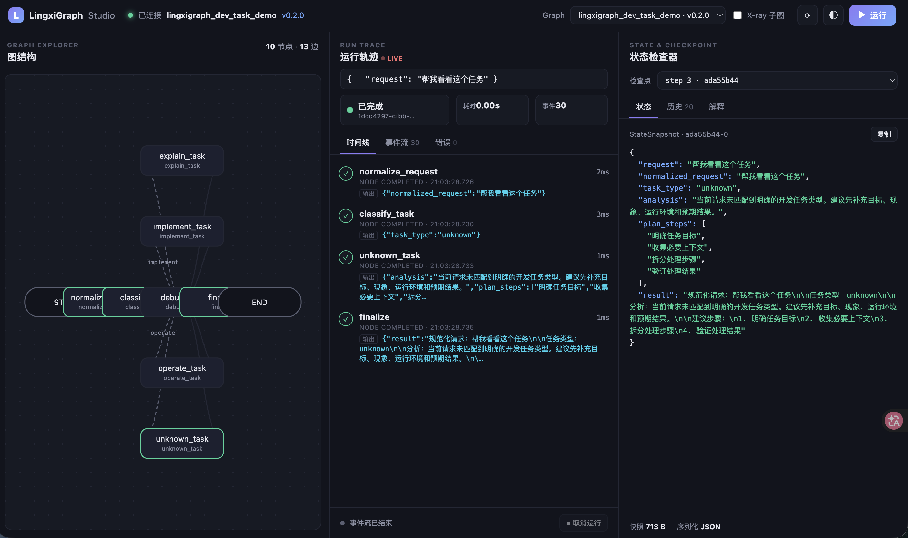

# lingxigraph-dev-task-demo

一个不依赖大模型的 LingxiGraph 最小技术验证项目，用于逐步演示状态图、条件路由、流式事件、人工审批、自动重试和 Checkpoint 恢复。

## 环境要求

- macOS
- Python 3.13.12
- uv
- LingxiGraph 2.x

## 安装

```bash
uv sync
```

## 启动本地开发服务器

```
uv run lingxigraph dev
```

## Studio 地址：

```
http://127.0.0.1:8124/studio/
```

## 验证 Python 版本

```
uv run python --version
```

## Develop

```bash
lingxigraph dev
```

Runs an in-memory Agent Server with an embedded Worker and opens the Studio at
http://localhost:8124/studio — no PostgreSQL or Redis required.

## Deploy (Docker Compose, single server)

```bash
lingxigraph up
```

Brings up PostgreSQL, Redis, migrations and the Agent Server (with embedded
Worker) on http://localhost:8124. Studio is served at `/studio`.

## Build the image

```bash
lingxigraph build
```

## Layout

- `lingxigraph_dev_task_demo/graph.py` — your trusted agent graph.
- `lingxigraph.json` — the manifest the Worker imports at deploy time.
- `docker-compose.yml` — single-server production topology.

## Stage 1：文本处理流水线

Stage 1 使用三个确定性的 Python 节点处理开发任务，不依赖任何大模型：

```text
START
  ↓
normalize_request
  ↓
structure_task
  ↓
finalize
  ↓
END
```

节点职责：

- `normalize_request`：保留原始请求，去除首尾空格并合并多余空白。
- `structure_task`：按照确定性关键词规则生成任务分析和处理步骤。
- `finalize`：将规范化请求、分析和步骤汇总为统一结果。

### 本地调用

```bash
uv run python - <<'PY'
from lingxigraph_dev_task_demo.graph import graph

result = graph.invoke({
    "request": "  请帮我   分析这个 Python 接口为什么返回 500  "
})

print(result["result"])
PY
```

### Stage1流式输出

Stage 1 同时支持：

- `updates`：观察各节点提交的状态增量。
- `custom`：观察节点通过 `runtime.stream_writer()` 发送的业务进度。

```python
for mode, chunk in graph.stream(
    {"request": "请分析接口返回 500 的原因"},
    stream_mode=["updates", "custom"],
):
    print(mode, chunk)
```

### Stage1 Studio 截图


## Stage 2：确定性条件路由

Stage 2 在 Stage 1 文本规范化能力的基础上，增加任务分类节点和条件边。

图不再让所有请求经过同一个任务处理节点，而是根据状态中的 `task_type` 选择唯一的业务分支。

```
START
  ↓
normalize_request
  ↓
classify_task
  ↓
conditional edge
  ├── explain_task
  ├── implement_task
  ├── debug_task
  ├── operate_task
  └── unknown_task
          ↓
       finalize
          ↓
         END
```

### Stage 2 状态变化

Stage 2 在共享状态中增加：

```
task_type: Literal[
    "explain",
    "implement",
    "debug",
    "operate",
    "unknown",
]
```

`task_type` 属于控制状态，用于决定图下一步执行哪个节点。

例如：

```
{
    "request": "修复数据库连接超时问题",
    "normalized_request": "修复数据库连接超时问题",
    "task_type": "debug",
}
```

条件路由函数读取 `task_type`，并选择 `debug_task`。

### 节点职责

### `normalize_request`

规范化用户输入，并保留原始请求。

### `classify_task`

调用固定的 Python 关键词规则，产生以下任务类型之一：

- `explain`
- `implement`
- `debug`
- `operate`
- `unknown`

### `route_task`

读取 `task_type` 并返回对应的路由名称。

该函数是条件边的路径选择函数，不是独立的图节点，因此不会单独出现在运行轨迹中。

### 业务分支节点

- `explain_task`：生成概念解释方案；
- `implement_task`：生成功能实现方案；
- `debug_task`：生成故障排查方案；
- `operate_task`：生成环境操作方案；
- `unknown_task`：处理无法明确分类的请求。

### `finalize`

将选中分支产生的分析和步骤汇总为统一结果。

### 路由规则

| 任务类型    | 关键词示例                               | 处理节点         |
| ----------- | ---------------------------------------- | ---------------- |
| `explain`   | 解释、原理、区别、为什么、介绍、说明     | `explain_task`   |
| `implement` | 实现、开发、创建、添加、编写、新增       | `implement_task` |
| `debug`     | 报错、异常、失败、超时、修复、排查       | `debug_task`     |
| `operate`   | 部署、删除、重启、迁移、推送、发布、回滚 | `operate_task`   |
| `unknown`   | 未命中明确关键词                         | `unknown_task`   |

### 确定性分类

分类过程只依赖：

- 当前输入文本；
- 固定关键词集合；
- 固定路由优先级。

分类过程不使用：

- 随机数；
- 大语言模型；
- 网络请求；
- 当前时间；
- 可变的外部状态。

因此，同一段输入重复执行时，会得到相同的任务类型和路由结果。

### 多关键词冲突处理

一个请求可能同时包含多类关键词，例如：

```
请解释生产环境部署失败的原因
```

该请求同时命中：

- `解释` → `explain`
- `部署` → `operate`
- `失败` → `debug`

项目使用固定优先级处理冲突：

```
operate > debug > implement > explain
```

因此，该请求稳定进入：

```
operate_task
```

将操作类任务设置为最高优先级，是为了让部署、删除、重启、迁移等请求进入统一的操作分支。

后续 Stage 3 将在该分支后增加风险评估和人工审批，避免高风险操作绕过安全检查。

### 未知任务兜底

无法明确分类的请求不会被强制归入已有类别。

例如：

```
帮我看看这个任务
```

该请求会进入：

```
unknown_task
```

兜底节点会提示用户补充：

- 任务目标；
- 当前现象；
- 运行环境；
- 预期结果。

这种设计避免系统在信息不足时假装已经理解用户意图。

### Stage 2 本地调用

当前项目默认入口已经指向 Stage 2：

```
uv run python - <<'PY'
from lingxigraph_dev_task_demo.graph import graph

result = graph.invoke(
    {
        "request": "修复数据库连接超时问题"
    }
)

print("任务类型：", result["task_type"])
print("分析：", result["analysis"])
print("处理步骤：", result["plan_steps"])
print()
print(result["result"])
PY
```

预期任务类型：

```
debug
```

### 查看条件路由轨迹

```
from lingxigraph_dev_task_demo.graph import graph

for update in graph.stream(
    {"request": "修复数据库连接超时问题"},
    stream_mode="updates",
):
    print(update)
```

对应路径为：

```
normalize_request
→ classify_task
→ debug_task
→ finalize
```

其他业务分支不会执行。

### 自定义流式事件

```
from lingxigraph_dev_task_demo.graph import graph

for event in graph.stream(
    {"request": "为项目添加健康检查接口"},
    stream_mode="custom",
):
    print(event)
```

可以依次观察：

```
normalize_request
classify_task
implement_task
finalize
```

自定义事件还会携带分类结果，例如：

```
{
    "stage": "classify_task",
    "message": "任务类型分类已完成",
    "task_type": "implement",
}
```

### Stage 2 测试样例

| 输入                         | 预期类型    |
| ---------------------------- | ----------- |
| 解释 Python 装饰器的执行过程 | `explain`   |
| 为项目添加健康检查接口       | `implement` |
| 修复数据库连接超时问题       | `debug`     |
| 将新版本部署到生产服务器     | `operate`   |
| 帮我看看这个任务             | `unknown`   |

### 自动化测试

运行所有测试：

```
uv run pytest -q
```

运行 Stage 2 测试：

```
uv run pytest tests/test_stage2_router.py -v
```

运行代码质量检查：

```
uv run ruff check .
uv run mypy lingxigraph_dev_task_demo
git diff --check
```

当前测试覆盖：

- 文本规范化；
- Stage 1 固定流水线；
- `explain` 路由；
- `implement` 路由；
- `debug` 路由；
- `operate` 路由；
- `unknown` 兜底；
- 多关键词固定优先级；
- 条件边只执行选中分支；
- `updates` 流式轨迹；
- `custom` 自定义事件。

### Studio 验证

启动本地开发服务器：

```
uv run lingxigraph dev
```

打开：

```
http://127.0.0.1:8124/studio/
```

Stage 2 图应显示：

```
10 个节点
13 条边
```

其中包含：

```
START
END
normalize_request
classify_task
explain_task
implement_task
debug_task
operate_task
unknown_task
finalize
```

输入不同请求后，Studio 中应只执行对应的一个业务分支。

## Stage 2 Studio 截图



### 当前阶段限制

当前版本主要验证 LingxiGraph 的状态图和确定性路由能力。

暂时不包含：

- 大语言模型调用；
- 真实 Shell 命令执行；
- 真实服务器部署；
- 风险等级判断；
- 人工审批；
- SQLite Checkpoint；
- 自动重试；
- 进程重启恢复。

所有节点只生成模拟分析和建议步骤，不执行具有破坏性的真实系统操作。
